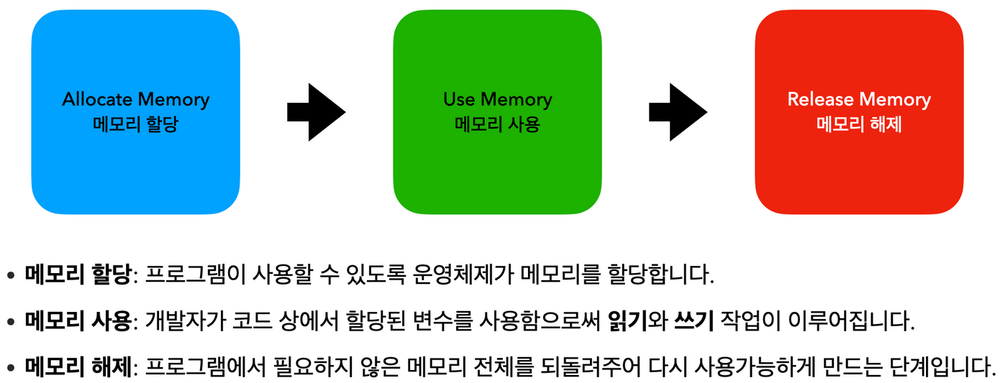

## 최적화(Optimization)

웹 브라우저의 성능이 해마다 빠르게 향상되고 있다. 웹에서 더욱 다양한 사용자 경험을 제공할 수 있게 된 만큼, 사이트를 구성하는 자바스크립트 코드가 양적으로 크게 증가했다.

이전에는 웹브라우저로 인해 성능 문제가 발생했다면, 지금은 자바스크립트로 인한 성능 문제가 다수 발생하게 된 것이다.

> **성능 문제의 대표적인 증상**
>    - 랜딩페이지 응답 지연과 구동 지연
>    - 스타일시트 적용 지연 등...


보통 실무에서 최적화는 다른 작업보다 우선순위가 많이 떨어지는 경향이 있다.

> ***Make it work, Make it right, Make it fast***
> - Kent Beck

소프트웨어 프로그래밍은 일단 동작하게 만들고(Make it work), 올바르게 동작하게 만들고(Make it right), 빠르게 동작하게 만든다(Make it fast)라는 전략으로 접근하기 때문. 올바르게 동작하기까지 만들고 만족하는 경우가 많다.

하지만 성능 최적화가 된 코드는 곧 서비스 만족도 향상으로 이어지며, 사용자 이탈률을 줄이는 데 큰 기여를 하므로 자바스크립트 성능 최적화는 매우 중요한 작업이다.

[속도가 왜 중요합니까? - web.dev](https://web.dev/why-speed-matters/)

<br>

## 성능 측정의 척도
성능을 측정하는 기준은 크게 두 가지로 나뉜다.

1. 올바르게 동작하는가?
2. 빠르게 동작하는가?

`올바르게 동작하는가?`는 메모리, 네트워크 트래픽과 같은 자원을 효과적으로 사용하는 것과, `빠르게 동작하는가?`는 구 동 시간, 응답 시간 등 시간과 긴밀한 관계가 있다.

<br>

## 시간 - 빠르게 동작하는가?

시간 측면에서 고려해야 하는 것은 아래 세 가지를 꼽을 수 있다.

- 초기 구동 시간 : 초기에 애플리케이션이 로드되는 시간
- 반응(응답) 시간 : 사용자의 행동에 얼마나 빠르게 반응하는가
- 계산 시간 : 동일한 계산을 얼마나 빠르게 수행하는가
    (효율적이고 빠르게 계산을 수행하도록 코드 작성. 알고리즘의 영역이다.)

### 초기 구동 시간

초기 구동 시간을 줄이기 위해서는 다음과 같은 기법들을 사용할 수 있다.

1. 다운로드 해야 하는 파일 갯수와 용량을 작게 유지한다.
    - 이미지 스프라이트 기법을 적극적으로 사용
    - 가능한 최신 포맷의 이미지 사용(WebP 등. srcset 태그를 활용해 IE 지원 유의)
    - 이미지 용량 최적화 툴 사용 ([kraken.id](https://kraken.io/) 이용)
    - 최적화된 폰트 사용. 사용하려는 폰트의 용량을 체크하고 가능한 최신 포맷의 폰트를 사용한다. (woff2 등)
    ```css
    @font-face{ 
	font-family:'Nanum Gothic'; 
	src:url(NanumGothic.woff) format(‘woff’);
	src:url(NanumGothic.woff2) format(‘woff2’); 
    }
    /* format(‘’) 값을 명시적으로 작성하면 
    이 형식을 지원하는 브라우저만 글꼴을 내려받게 되어 있습니다. */
    ```
2. 최소화한 CSS, JS 파일을 사용하여 파일의 용량을 줄인다.
3. 라이브러리, 프레임워크는 필요한 것만 사용한다.
4. 중요하지 않은 컨텐츠는 `loading="lazy"` 속성의 사용을 고려한다. [img loading - MDN](https://developer.mozilla.org/ko/docs/Web/HTML/Element/img#attr-loading)

위의 방법들을 시도하며, 개발 과정 중 지속적으로 구동시간을 측정하고 관리해야 한다.

> 구동 시간 측정하는 법
>    - Chrome 개발자도구의 Performance, Network 탭
>    - [pagespeed.web.dev](https://pagespeed.web.dev/)

### 반응 시간

`사용자의 행동에 얼마나 빠르게 반응하는가`를 판단하는 것이 반응 시간이다.
이 반응 시간을 줄이기 위해서는, 브라우저의 렌더링 방식을 이해할 필요가 있다.

> [웹페이지 렌더링](웹페이지_렌더링.md)

렌더링을 빠르게 만들기 위해 다음 기법들을 사용할 수 있다.

1. JS보다는 CSS 애니메이션을 활용한다.
    - JS로 스타일을 수정하면, CSS 속성으로 업데이트하는 연산이 한번 더 일어나게 된다.
2. Transform 속성을 사용한다.
    - 모던 웹 브라우저는 GPU를 사용해 웹 페이지의 일부를 렌더링한다. Transform 속성을 사용하면 GPU를 효과적으로 활용할 수 있게 되며 성능을 향상시킬 수 있다.
3. repaint, reflow를 유발하는 속성의 사용을 지양한다.
    - [csstrigers](https://csstriggers.com/)에서 속성 별 reflow & repaint에 대한 정보를 확인할 수 있다. 브라우저의 렌더링 엔진에 따라 차이가 있음을 주의.
4. requestAnimationFrame을 사용한다.
    - requestAnimationFRame은 브라우저가 애니메이션을 최적화하도록 하고, 비활성 탭에서는 애니메이션이 동작하지 않도록 돕는다. ([MDN](https://developer.mozilla.org/ko/docs/Web/API/Window/requestAnimationFrame))
5. DOM 작업은 느리다 - DOM 접근과 업데이트는 가능한 적게 한다.
    - document.querySelector 메소드는 전체 DOM을 인자에 맞는 노드를 만날 때까지 탐색한다. DOM 접근은 가능한 좁은 범위에서 사용해 전체 DOM 순회를 줄이고, 가능한 접근을 최소화한다.
    - DOM을 업데이트 할 때는 DocumentFragment를 사용한다.
        (DocumentFragment : 오직 메모리상에서만 존재하는 경량화된 DOM 트리)

<br>

## 메모리 - 올바르게 동작하는가?

### 메모리의 생명주기

메모리를 효율적으로 사용하기 위해서는 메모리의 생명주기에 대한 이해가 필요하다.



<br>
<small>
참고 <br>
<a href="https://youtu.be/9MZl8Uq9Gmw">자바스크립트 성능 최적화 기법</a><br>
<a href="https://ui.toast.com/fe-guide/ko_PERFORMANCE">성능 최적화 - toast</a><br>
제주코딩베이스캠프 javascript-최적화
</small>