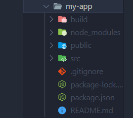
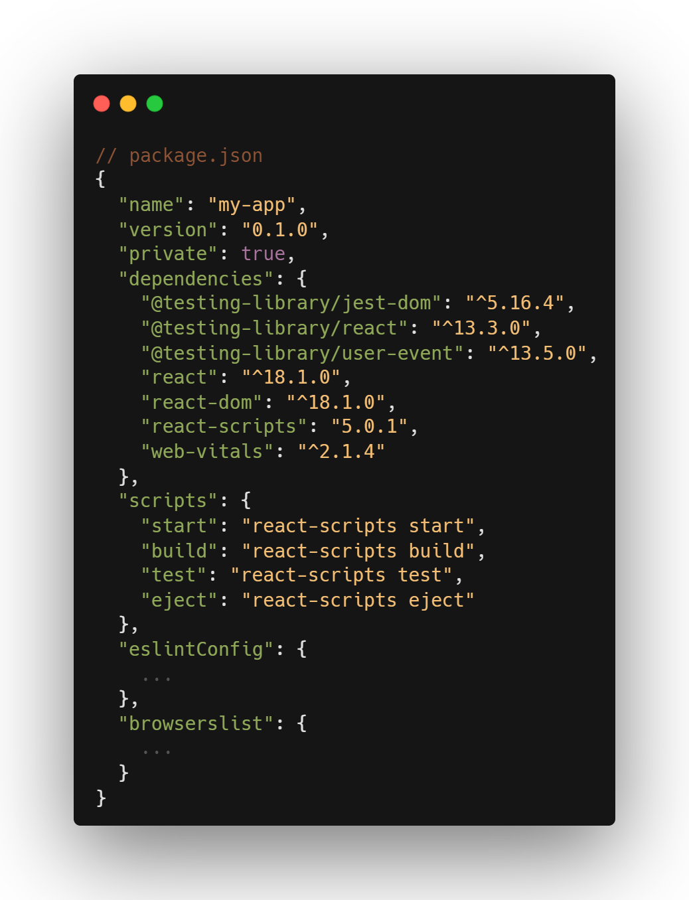

# create-react-app이 무슨 일을 할까?

리액트 프로젝트를 만들 때 `npx create-react-app {프로젝트 이름}` 명령을 사용해 환경을 셋팅한다.



명령을 사용하면 명시한 이름의 폴더의 안에 여러 파일들이 생성되는 것을 볼 수 있는데, 아직 학습 단계에 있으면서 만지는 파일이라고는 src 폴더 안의 몇개의 js파일들과 public 폴더의 index.html 파일 뿐이다.

그 외의 파일들은 아예 삭제를 하기도 하는데, 각각 어떤 역할을 하길래 삭제하는걸까, 궁금증이 생겼다.

오늘은 한번 create-react-app에 대해 얕게 파헤쳐 보자.

## create-react-app?

**`Create React App`은 React의 Boiler Plate이다.**

보일러 틀에 여러 개의 보일러를 찍어내듯, **초기 환경을 일일히 설정하지 않고도 리액트 프로젝트를 시작할 수 있도록 셋업을 완료**해놓은 틀이라고 보면 된다.

React 앱을 만들 때는 React 라이브러리 뿐 아니라 **Webpack**, **Babel** 등의 라이브러리들이 필요하다.

Webpack은 리액트 프로젝트에서 사용되는 **여러 개의 자바스크립트 파일을 하나로 합쳐주는 모듈 번들러**이며, Babel은 **프로젝트에서 JSX 문법을 사용할 수 있게 해준다.** 이외에도 다양한 라이브러리를 사용하는데, 이런 부수적인 모듈을 개발자가 일일히 다운받기는 번거로운 일이다.

이렇게 패키지 등 **번거로운 react 초기 셋팅 작업**을 미리 하고, **그 환경을 다시 패키징한 것**이 바로 `create-react-app`이며, 축약해 CRA이라고도 부른다.

>  > [공식문서](https://create-react-app.dev/)

## create-react-app 패키지 구성

`create-react-app`을 실행한 뒤 설치된 프로젝트 폴더의 구성은 다음과 같다.

> ```
> 프로젝트
> ├── README.md
> ├── package-lock.json
> ├── package.json
> ├── node_modules
> │ └── ...
> ├── public
> │ ├── 🗑 favicon.ico
> │ ├── index.html
> │ ├── 🗑 logo192.png
> │ ├── 🗑 logo512.png
> │ ├── 🗑 manifest.json
> │ └── 🗑 robots.txt
> └── src
>   ├── 🗑 App.css
>   ├── App.js
>   ├── 🗑 index.css
>   ├── index.js
>   ├── 🗑 logo.svg
>   ├── 🗑 reportWebVitals.js
>   └── 🗑 setupTests.js
> ```

테스트 js 파일이나 favicon 등 React 앱을 개발할 때 필요한 세팅이 되어있지만, 프로젝트에 따라 몇몇 파일들을 삭제해야 할 수도 있다.

특히 학습할 때는 앱 실행에 지장을 주지 않는 파일들을 삭제해 디렉토리 구조를 단순화해 혼란을 줄이는 것이 도움이 된다.

> 파일명 앞에 🗑 아이콘이 붙은 학습 단계에서 삭제해도 실행에 영향을 미치지 않는 파일이다.
> src 폴더의 파일들은 App.js와 index.js가 참조하고 있으니, 삭제 후 코드를 수정해주어야 한다.

### node_modules 폴더

node.js의 패키지 구성요소 중 하나로 **외부 모듈을 저장하는 폴더**이다. react도 외부 모듈이므로 여기에 저장된다.

node_modules 폴더는 설치된 외부 모듈들의 소스코드를 갖고있기 때문에 매우 큰 용량을 차지한다. 협업을 위해 github나 드라이브에 프로젝트를 공유할 때는 **`.gitignore` 파일에 반드시 명시해 공유하는 파일의 용량을 줄여야 한다.** (create-react-app을 통해 생성한 프로젝트의 .gitignore에는 이미 포함되어있다.)
<br>

> **_Q. 프로젝트를 공유받을 때 `node_modules` 폴더가 없는 상태가 되는데, 괜찮을까?_**
>
> **A. `npm i`를 입력하면 자동으로 node_modules이 다운로드 된다.** > `package.json`과 `package-lock.json`이 사용하는 패키지 정보를 담고 있기 때문.

### package.json 파일

package.json, package-lock.json 파일을 통해 패키지가 **어떤 설정을 갖고있는지, 어떤 패키지를 사용하고 있는 지 확인**할 수 있다.

패키지들을 연결하는 중요한 역할을 하고 있기 때문에 신중하게 수정해야 하고, 백업 없이 섣불리 삭제해서는 안된다.

package.json에서는 **내 프로젝트의 이름**, **주소**, **버전** 등을 설정할 수 있으며 **react의 버전**을 지정해줄 수도 있다.



**dependencies**에는 리액트 패키지들의 정보를 담고 있다. 각 패키지의 버전을 확인할 수도 있으며, 버전을 업그레이드할 경우 여기에 수정이 필요하다.

**scripts** 설정에서는 긴 명령에 별명을 붙여 사용할 수 있다.

```json
// package.json
{
  ...

  "scripts": {
    "start": "react-scripts start",
    "build": "react-scripts build",
    "test": "react-scripts test",
    "eject": "react-scripts eject"
  },

  ...
}
```

터미널에 `npm start`을 실행하면 `npm react-scripts start`를 실행한것과 같다.

### public 폴더

public 폴더에는 index.html 파일이 들어있다. 페이지의 제목을 변경하는 등의 작업을 수행할 수 있다.

> - **favicon.ico**
>   웹 사이트의 아이콘
> - **index.html**
>   홈 화면에 표시되는 html로, 페이지 템플릿이다.
> - **logo192.png / logo512.png / manifest.json**
>   모바일 웹브라우저에서 사이트를 홈 화면에 추가 할 때 사용
> - **robots.txt**
>   검색 엔진이 웹사이트를 수집할 때 수집 할 것과 하지 말아야 할 것을 명시해주는 파일

public 폴더 안의 파일은 Webpack이 후처리하지 않고, 빌드 폴더에 그대로 복사된다.

public 폴더를 사용해야 할 때가 궁금하다면 아래의 공식문서를 참고할 수 있다.

[Create React App - Using public Folder](https://create-react-app.dev/docs/using-the-public-folder/)

### src

src는 source code의 줄임말.

js, css 등의 코드를 저장하는 폴더이며 이 폴더 내부의 파일은 프로젝트 빌드 시 Webpack으로 처리된다.

> - **App.css / App.js**
>   앱이 실행되는 메인 코드와 그의 stylesheet. js파일이지만 JSX로 작성되어 있다.
> - **App.test.js**
>   App.js를 테스트 할 때 사용하는 파일
> - **index.css / index.js**
>   index.html과 연결된 js파일과 그의 stylesheet. 자바스크립트의 진입점이다.
> - **setupTest.js**
>   테스팅 라이브러리를 import하는 파일
> - **logo.svg**
>   앱에서 사용하고 있는 svg파일. 삭제가능
> - **reportWebVitals.js**
>   앱의 퍼포먼스시간들을 분석해주는 기능을 담은 파일

---

## 레퍼런스

> - [Using public Folder - Create React App](https://create-react-app.dev/docs/using-the-public-folder/)
> - [CRA 디폴트 파일 reportWebVitals ..!?-velog](https://velog.io/@sunhwa508/reportWebVitals%EC%9D%84-%EC%82%AC%EC%9A%A9%ED%95%B4%EB%B3%B4%EC%8B%A0%EB%B6%84)
> - 지금바로 React 시작하기 - 제주코딩베이스캠프
